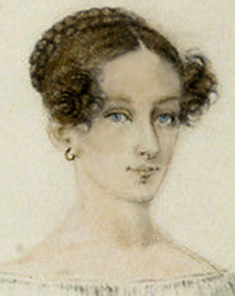

# Frankenstein

#### Mary Shelley {.unlisted}

*Book Club November 3, 2024*

---

*Frankenstein* is of course one of the most famous and influential novels ever 
written. Yet it remains drastically misunderstood. In the original era of its 
being this was due largely to neglect of its actual text in favor of the stage 
adaptations and bowdlerized retellings which swamped the novel itself in 
popular imagination in the wake of its sudden fame and notoriety. In our own 
time it is the intense scholarly scrutiny the work has come under that makes it 
possible to make endless accurate observations without any urgency about coming 
to the actual point.

\captionsetup[figure]{labelformat=empty}
{width=20% fig-align="center"}

It is often the case, indeed expected, that the full meaning and significance 
of the greatest novels only comes clear with the passage of time and the 
perspective that comes with it. But with *Frankenstein* the movement has been 
in the opposite direction. Any enduring significance of the novel must 
in the final analysis be grounded in the fact that it was fashioned for and 
exquisitely attuned to its own time, even to the author's own household and the 
private and public dramas therein enacted. And as it mutates its way down the 
centuries through popular culture it seems, that for all the attention it has 
attracted, only its earliest readers had the privilege of opportunity to see it 
plain, to endure its full execration, and if they could bear to see it through, 
to perceive the quantum of benediction that only full and merciless clarity can 
deliver.

## The Original Reader's State of Mind

The first thing likely to have aroused the attention of a reader of the 
original publication is that it was dedicated to William Godwin (Mary Shelley's 
father, although the reader would not have known that since the novel was 
published anonymously).  Godwin was a notorious public figure of the previous 
generation, that of Europeans who came of age during the French Revolution and 
the Napoleonic wars that followed. He was a well-known philosopher and 
novelist, mild-mannered but with a possibly autistic capacity for extreme 
concentration, which led him to follow the consequences of his ideas to the 
limit heedless of personal cost. Namely, he asserted that reason was the only 
acceptable basis for personal and political decision-making.

Raised in an extended family dominated by clergymen, he quickly deduced that 
God does not exist and thus cut himself off from his expected career. The start 
of the French Revolution had a profound effect on him, as it did for many 
people his age. The Revolution threw Europe into years of turmoil, not just 
militarily and politically, but philosophically and culturally as well. 
Suddenly, as in the 1960s, all aspects of life were up for discussion and 
negotiation, from the largest social and government institutions like the 
church and the monarchy, to the most intimate personal and sexual relationships.

Everyday debates penetrated beyond the fears and apprehensions of the day to 
the deepest existential levels. Why does tyranny exist? Why are most people 
poor and miserable? Why is it so hard to bring about improvements? What prompts 
a body politic to tip over into revolution? Godwin responded to the times by 
writing a lengthy philosophical treatise laying out his argument that reason is 
the only sound foundation for a just society, and social ills are the 
inevitable consequence of the blindness that comes with irrationality. He 
followed that argument to the natural conclusion that institutions of 
hereditary power, like the monarchy and the church, were illegitimate.

To publish this work when Britain's Establishment felt itself under mortal 
threat, amid daily fears of invasion and insurrection, was an act of great 
courage, and it made him famous. He became a hero of liberals in England and 
Europe. But he also earned the enmity of the Establishment. No official action 
was taken against him, but the government made it quietly known that he was 
anathematized. The mainstream press accordingly portrayed him as a fool with 
book learning but no sense, and a depraved degenerate for his atheism and 
opposition to marriage. His writings stopped selling and he struggled to earn 
a living, relying heavily on loans from still-loyal supporters.

Early readers who were paying attention saw *Frankenstein* as something of a 
pastiche of Godwin's philosophical writing and his novels (which he wrote to 
bring his ideas to larger audiences), with the added effrontery to God of a 
revived corpse a natural extension of Godwin's heretic influence on the young.

But an open-minded reader familiar with Godwin's writing might have noticed an 
ironic dimension to the *Frankenstein* author's tribute. Frankenstein was 
strongly influenced by Godwin's first novel, his biggest hit -- called *Things 
As They Are*, it is about a man falsely accused of murder by his wealthy 
employer who is the actual culprit. The authorities will not believe the man's 
testimony over his employer's, or consider his evidence, and he is chased by 
agents of the law across England, witnessing the petty tyrannies and injustices 
of everyday life endured by the powerless and disenfranchised. The novel ends 
with a climactic confrontation in court between master and servant, where the 
master finally admits guilt and the two reconcile, each confessing the pain 
that the severing of their relationship had caused; the master dies soon 
afterward.

*Frankenstein* of course features murder, pursuit, injustice and class 
conflict. But notably there is no final confrontation, except of corpse with 
corpse. The denouement is unremittingly bleak and flat, and there is no clear 
resolution of the conflict of opposing forces on the surface narrative level of 
the text. 

As such, the ending of *Frankenstein* hints at an ironic turn on the older 
author, an implicit rebuke: there are no easy reconciliations or facile 
answers, justice is elusive, and the truth is visible only when pretensions are 
stripped bare and one is pushed against one's will and even one's reason to the 
limit of endurance. The early reader might have perceived the author's message 
to Godwin, behind the tributes, to be 'you did not go far enough.'

## Mary Shelley's State of Mind

Frankenstein incorporates influences and references that would have been 
evident to the alert contemporary reader. But Shelley includes clues and 
allusions whose significance could only have been known or suspected by a tiny 
inner circle of family and acquaintances. This suggests that in important ways 
the work was directed squarely at her father and was primarily or largely an 
attempt to communicate with him; more to the point, an effort to show him how 
his diagnosis of the ills of society as laid bare by the French Revolution and 
his advocacy of pure reason as the panacea fell short, using the dynamics of 
his own household as illustration.

Godwin was a revolutionary but not a firebrand. He was mild-mannered, socially 
awkward and often emotionally withdrawn. Nevertheless, he had a big ego, and 
bitterly resented his fall from fame and reduction of influence in current 
affairs under the government's soft ban on him, enforced for over a decade by 
the time Mary was a teenager. He loved Mary and recognized her special 
potential among his children, and so gave her a first-rate education -- but 
undergirding this effort was a hope that she would use her talents to serve him 
as his biographer and archivist, thus rescuing his reputation for posterity 
after his death.

He was little comfort to Mary when her infant first child died. He suggested 
she use reason to rationalize the experience and get past it. He was conversely 
delighted when she legitimized her relationship with Percy Shelley by marrying 
him, despite Godwin's well-known opposition to marriage on philosophical 
grounds -- perhaps thinking that having as son-in-law the son and heir of a 
wealthy baronet would aid a return to respectable society.

All this is to say that Godwin had a big ego, big enough to equate his personal 
interests sometimes with the interests of his mission to advance social justice 
for the good of all. And the operation and maintenance of his ego sometimes did 
damage to the people he shared his life with.

Godwin was an avid book collector. He was said to have one of the best private 
libraries in England. He was an innovator in the performance of active 
comparative research to inform his writing, and put his collection to that use 
as well as for the education of his children. One of his favorite topics to 
collect was works of  gnostic and esoteric philosophy and religion, of just the 
kind teenage Victor Frankenstein was fascinated by. 

But he did not share Victor's motivation for this interest. Godwin acquired 
works on the topic to use them as fodder for ridicule in his own work. 'Look at 
what people who have departed from reason would have you believe,' was his 
message. 'Look at these fanciful notions, these silly superstitions! They're 
absurd!'

Mary was intimately familiar with her father's work and the contents of his 
library, and must have seen how the latter informed the former. But she did not 
take her father's dismissals of gnostic philosophy at face value. Rather, it 
was her extraordinary insight that gnostic philosophy, lurking in the 
background of civilization from the beginning, was a symptom of a malady, a 
malady from which her own father suffered. And it was the malady of Godwin's ego 
that drove him to denigrate gnosticism and deprecate it in favor of his own 
philosophy

For the motivation at the heart of the work of the gnostics was to salve and 
prop up male ego, ultimately to forge and wield ego as a shield against 
existential terror inflamed by humanity's stranding in an infinite and 
unfathomable universe. Mary's depiction of gnostic writings as Frankenstein's 
motivator could hardly be anything but a subtle lampooning of Godwin, a 
perceptive casting of his abreaction to them as the rage of Caliban seeing his 
own face in a glass, as it were.

Godwin had let himself be taken over by the kind of ego which gnostic 
philosophy was designed to build and bolster. He was a petty tyrant in his own 
house. He famously said "necessity [of governmental authority and violence] 
does not arise out of the nature of man, but out of the institutions by which he 
has already been corrupted." He taught that tyranny infiltrated osmotically 
from corrupt social frameworks into personal relationships. In *Frankenstein* 
Mary suggested that the dynamic operates in reverse, that the seed of tyranny 
grows from individual terror, which produces the defense mechanism of 
pathological ego, the toxic effects of which are exported to the world.

Mary grew up surrounded by exceptional male egos -- through her childhood her 
father was still in social contact with many leading literary and political 
figures and often had them as guests at his house. She fell in love with and 
married another exemplar, Percy Shelley, and socialized extensively with Lord 
Byron. Her sharp perception must have brought familiarity with how such egos 
operate, and how it would be pointless, counterproductive, to confront and 
critique them directly -- indeed would be evidence of toxic assertion of one's 
own ego.

But her intellect and will allowed her to formulate an oblique strategy. She 
took her father on at his own game and wrote a novel. She could be sure he 
would read it closely, out of both fatherly pride and anxiety over what impact 
it might have on his own reputation; as well as morbid concern over whether her 
literary gifts might threaten to overshadow his. He could not have failed to 
observe that the book was filled not only with references to his published work 
but also allusions to intimate details of his home life. But she avoided a 
direct clash, she constructed it so that he was free to allow his ego to ignore 
the special ironic indictments laid out just for him and take it just for what 
it appeared to be, a popular entertainment.  

Then as now, the novel quietly offers up an arc light of insight, but hides 
it within a labyrinthine story in which a reader's ego is likely to become 
disoriented and lost. The original intended reader was free to ignore the lamp 
of interrogation and indictment (as is the modern one). But if the novel has 
accrued any benefit from the passage of time and the occlusion of its original 
purpose, it is in the static charge gathering from the friction of turning 
away. Perhaps the terror of impending of explosive discharge will overwhelm the 
fears the pathological ego was designed to guard against. But not yet.

## Frankenstein's State of Mind

Victor Frankenstein is an ironic character in the classical sense. That is, he 
is a fool who is unaware of the true dynamics of events around him, and is 
unaware of how his own statements reveal his folly. Nothing he says can be 
taken at face value. His statements must be evaluated in the context of the 
entire text, and with the milieu in which it was written borne in mind.

Frankenstein described his upbringing thus:

\medskip
<i>

|    care and pain seemed for ever banished. My father directed our studies, and my 
|    mother partook of our enjoyments. Neither of us possessed the slightest 
|    pre-eminence over the other; the voice of command was never heard amongst us; 
|    but mutual affection engaged us all to comply with and obey the slightest 
|    desire of each other.

</i>
\medskip

Yet literally one paragraph before this passage, he says of his middle brother 
Ernest:

\medskip
<i>

|    He had been afflicted with ill health from his infancy, through which Elizabeth 
|    and I had been his constant nurses: his disposition was gentle, but he was 
|    incapable of any severe application.

</i>
\medskip

Later when Victor is preparing for college he says of his friend Henry, who was 
so close he practically grew up in the Frankenstein household:

\medskip
<i>

|    He bitterly lamented that he was unable to accompany me: but his father could 
|    not be persuaded to part with him, intending that he should become a partner 
|    with him in business, in compliance with his favourite theory, that learning 
|    was superfluous in the commerce of ordinary life. Henry had a refined mind; he 
|    had no desire to be idle, and was well pleased to become his father's partner, 
|    but he believed that a man might be a very good trader, and yet possess a 
|    cultivated understanding.

</i>
\medskip

Victor also related how his father and mother came to be married:

\medskip
<i>

|    One of [Frankenstein senior's] most intimate friends was a merchant, who, from 
|    a flourishing state, fell, through numerous mischances, into poverty. This man, 
|    whose name was Beaufort, was of a proud and unbending disposition, and could 
|    not bear to live in poverty and oblivion in the same country where he had 
|    formerly been distinguished for his rank and magnificence.

</i>
\medskip

Beaufort died of grief over his fall in fortune, leaving his daughter Caroline 
destitute:

\medskip
<i>

|    her father died in her arms, leaving her an orphan and a beggar. This last blow 
|    overcame her; and she knelt by Beaufort's coffin, weeping bitterly, when my 
|    father entered the chamber. He came like a protecting spirit to the poor girl, 
|    who committed herself to his care

</i>
\medskip

Frankenstein senior, old enough to be her father, married Caroline, and later 
commissioned a portrait to be set on the mantelpiece of their house:

\medskip
<i>

|    It was an historical subject, painted at my father's desire, and represented 
|    Caroline Beaufort in an agony of despair, kneeling by the coffin of her dead 
|    father... a daily reminder of the disparity of their status and fortunes at the time 
|    they wed.

</i>
\medskip

Young Victor's own testimony shows that the banishment of care and pain existed 
only in his imaginings. His upbringing was beset by disparities of class, 
wealth, education, gender role and health. He shows a kind of doublethink; he 
could articulate the sufferings and humiliations around him, but he elided them 
from his fantasy picture of home life.

He says when he was young:

\medskip
<i>

|    I felt as if I were destined for some great enterprise. My feelings are 
|    profound; but I possessed a coolness of judgment that fitted me for illustrious 
|    achievements. This sentiment of the worth of my nature supported me, when 
|    others would have been oppressed; for I deemed it criminal to throw away in 
|    useless grief those talents that might be useful to my fellow-creatures... But 
|    this feeling, which supported me in the commencement of my career, now serves 
|    only to plunge me lower in the dust... I trod heaven in my thoughts, now 
|    exulting in my powers, now burning with the idea of their effects. From my infancy I was 
|    imbued with high hopes and a lofty ambition; but how am I sunk! Oh! my friend, 
|    if you had known me as I once was, you would not recognize me in this state of 
|    degradation. Despondency rarely visited my heart; a high destiny seemed to bear 
|    me on, until I fell, never, never again to rise.

</i>
\medskip

When Victor was at the top of his social order, all his ego permitted him to 
acknowledge was a placid, perfect harmony among his companions and robust 
self-worth. But when adversity appeared and reality broke in to menace his 
self-image, Victor's obsession with class and its comforts revealed itself, and 
his secret terrors came forth -- terror of the possibility of disruption of 
life's hierarchies, (the psychic trauma of which killed old Beaufort), terror 
that existence may have nothing for him to assure that he is special, that he 
can command history, that his identity is immortal.

These secret terrors are why he fell for the authors of gnostic and esoteric 
religion and philosophy as a teen. Since literally the beginning of civilization 
every member of the ruling class has been taught that there is a natural order 
to existence, set in place by a supreme being, and every person, high and low, 
is put in the place they need to be to serve the functions that keep society 
healthy and harmonious, and thus every life is meaningful. In this view it was 
simply Victor's fortune that he was born near the top, destined to rule and 
reinforce a just system with his talents and good deeds.

But when Victor reached the stage of maturation where healthy adult identity 
formation can begin, he also acquired the capacity for doubt. He had the 
choice, like everybody does, to embrace doubt and thus become fully human. But 
anxiety over loss of privilege and identity got the better of him.

Gnostic philosophy teaches that the natural order can be validated and affirmed 
by study and meditation, and the supreme being can be perceived directly by an 
alert and prepared mind.

And so the works Victor read promised just the assuaging of doubt he was 
seeking: that there is a provable purpose, meaning and structure in the world, 
that there is a hierarchy of merit and value put in place and maintained by a 
supreme being, that there will be retribution for those who seek to disrupt the 
hierarchy, and protection and restoration for those threatened with 
dislodgement from it.

Lack of such assurances brings the threat of the primal terror, that of 
exposure to the abyss, of the fear there are no boundaries between the 
individual and the material world, and thus that individual identity is an 
illusion and can dissolve. Gnostic teachings, indeed all of the rituals of 
civilization-building into which those teachings are interwoven, are coping 
mechanisms, techniques for growing artificial ego structures that suppress the 
terror out of consciousness.

But no amount of scholarly reassurance could exorcise Victor's terror 
completely. He became disenchanted with his gnostic authors when he witnessed a 
tree destroyed by a bolt of lightning. But it is not the case, as is usually 
explained by commentators, that he at this point left gnostic thinking behind 
and was converted to the intellectual discipline of science.

Rather, the scene of the tree's destruction was a tableau of his worst fears. 
It was an old and beautiful oak, strong, serene, an ancient and majestic 
feature of the landscape of his father's estate, emblematic of the stability 
and serenity of his family line and his place in the world, and of the 
approbation of the supreme being. But a bolt of electricity blew it out of 
existence in literally the blink of an eye.

Victor's eventual choice of science over his gnostic scholars came not because 
they had no explanation for what lightning is and were thus delegitimized, but 
because science provided the only lifeline for him to rationalize the 
destructive power of natural forces and incorporate them meaningfully into his 
world view, thus to construct a new framework enabling him to resume pursuit of 
validation of his worth in the face of evidence that the world is chaotic and 
contingent. It was just a change of tactics.

It was Victor's intention to prove the ultimate validity of the gnostics' 
vision of a universe with meaning, purpose and a destiny, and demonstrate his 
privileged place as a favorite of the supreme being near the top of the 
hierarchy of merit by taming the forces of nature and marshalling them to bring 
the dead to life using the up-to-date tools of science, thus revealing the 
power behind the power.

He said: "Life and death appeared to me ideal[^ideal] bounds, which I should 
first break through, and pour a torrent of light into our dark world." This is 
the gnostic vision, which teaches that the universe is all light, except our 
material plane, which is an illusion of shadows where the appearance of death 
is a mirage. The intent of gnostic teaching is to allow the individual to break 
through to the light and dispel the illusion.

He said: "A new species would bless me as its creator and source; many happy 
and excellent natures would owe their being to me. No father could claim the 
gratitude of his child so completely as I should deserve their's." This is a 
reflected image of the gnostic demiurge, who created the material world and a 
hierarchy of powers to run it, from stars to planets and so on to men, for the 
purpose of being worshipped and to bolster his false belief in his 
own transcendent worth.

When the monster awoke, Victor expected its mind to be uncorrupted and to 
receive from it some form of acknowledgement or *Ave* from the supreme being, 
and to hear its truths spoken. When the monster turned out to be mute, 
apparently idiotic, and obviously a shambling assembly of corrupt and hideous 
parts rather than a sublime whole, Victor was confronted face-to-face at last 
with his worst misgiving, that instead of proving his theories he had 
disproven them: that he had no special status, that the universe was as 
mindless as the monster, existence a product of blind impersonal forces, 
meaningless.

This is why Victor ran immediately from the animated monster, despite it being 
a great scientific breakthrough, the brilliant culmination of over a year of 
labor. And it's why he went to sleep and dreamed as he did. His vision of his 
beautiful cousin Elizabeth morphs into horror:

\medskip
<i>

|    as I imprinted the first kiss on her lips, they became livid with the hue of 
|    death; her features appeared to change, and I thought that I held the corpse of 
|    my dead mother in my arms; a shroud enveloped her form, and I saw the 
|    grave-worms crawling in the folds of the flannel.

</i>
\medskip

Why and in what form is his mother here? Does he have an Oedipal complex? No, 
the mother of his vision is not the one who raised him, the aged mother who died 
of scarlet fever. Fine society ladies were not buried in flannel shrouds. 
Flannel was the cheapest material available; in nineteenth century England, 
"buried in a flannel shroud" was a euphemism for "died a pauper." The mother he 
dreamed was the one from the portrait in his house, hung over the mantel so he 
saw it every day growing up, fallen from the heights of Geneva society to "an 
agony of despair" -- evidence of an uncaring or non-existent God and redeemed 
only by chance[^chance]

The ego injury Victor suffered as a result of not getting the validation he 
expected drives his behavior through the rest of the novel. He expresses 
denial, rage, depression, obsession with revenge, even unto death. He had a 
choice; by the time he'd been informed of the death of his brother William, 
he'd seen examples of redeeming, life-giving care -- "unbounded and unremitting 
attentions" -- his mother's toward Elizabeth and Justine, Henry's toward him. 
Even his father seemed moved and softened, for even in the face of his youngest 
son's murder, he counseled Victor: 

\medskip
<i>

|    not brooding thoughts of vengeance against the assassin, but with feelings of 
|    peace and gentleness, that will heal, instead of festering the wounds of our 
|    minds. Enter the house of mourning, my friend, but with kindness and affection 
|    for those who love you, and not with hatred for your enemies.

</i>
\medskip

Gentleness and kindness might have made all the difference with the monster. 
Victor had the examples and the advice. But such a choice was unbearable to his 
ego.

## "All Men Hate the Wretched"

The aim of historian David Hacker Fischer's book *Albion's Seed* is to show how 
different colonist groups, who came from England to America in waves to 
different regions, critically shaped the contemporary culture, politics and 
economics of those regions primarily through their cultural practices 
("folkways") rather than by political or economic activities.

The Mid-Atlantic plantation-dominated colonies were settled by members of the 
aristocratic landowning class, many endeavoring to escape rapidly-democratizing 
England and re-establish their class hierarchy in the New World. The chief 
problem they faced was that their scheme required a peasant class, and there 
simply weren't enough people to fill the role.

Thus the landowning class began the importation of slaves:

\medskip
<i>

|    A system of plantation agriculture resting upon slave labor was not the only 
|    road to riches for Virginia's royalist elite... For its social purposes, it 
|    required an underclass that would remain firmly fixed in its condition of 
|    subordination. The culture of the English countryside could not be reproduced 
|    in the New World without this rural proletariat... [Slaves] were made to dress like 
|    English farm workers, to play English folk games, to speak an English country 
|    dialect, and to observe the ordinary rituals of English life in a charade that 
|    Virginia planters organized with great care.

</i>
\medskip

That is to say by way of example, all hierarchical class-based civilization has 
always been theater. The first prioroty of civilization is not given in any 
of the old theories; not conquest, not plunder, agriculture, city-building, 
economic competition or sex, but play-acting for the sake of the egos of the 
elites. The early land-owners of the Mid-Atlantic colonies were simply more 
up-front and conscious of what they were doing than most, and did it from 
scratch in the full light of history. But the terror-driven masque of the elites 
must go on, even if force and terror are required to keep the extras on their 
marks.

The monster is also a fool, but not an ironic fool like Victor. He is fortune's 
fool, victim of a trap laid intentionally by no persons, but arising 
spontaneously from clashing natural forces, a psychological Scylla and 
Charybdis.

Dr, Jonathan Shay, who specializes in treating extreme cases of post-traumatic 
stress disorder in Vietnam veterans, wrote the book *Achilles in VIetnam* after 
he experienced two realizations. The first was that the danger, terror, grief, 
injury and pain of combat were only contributory factors to extreme PTSD; in his 
clinical experience, the only soldiers who developed debilitating cases were 
those who also experienced a sense of betrayal or contempt by their own 
commanding officers and the military in general.

The second realization was that Achilles and other soldiers in the *Iliad* 
appeared to be suffering at different points in the poem from PTSD, Achilles in 
particular reacting to a perceived act of betrayal against him by Agamamnon, 
his own commanding general. The evidence in the poem's text suggested to Shay 
that identifying and treating this syndrome may have been the main motivating 
factor in the writing of the poem itself:

\medskip
<i>

|    Many aspects of the *themis* [moral sense of what's right] of American 
|    soldiers cluster around fairness. When they perceived that distribution of risk 
|    was unjust, they became filled with indignant rage, just as Achilles was filled 
|    with *mênis* [rage]... Homer uses the word *mênis* for Achilles only in 
|    connection with the wrong done to him by Agamemnon... I prefer "indignant rage" 
|    as a translation for *mênis*, because I can hear the word dignity hidden in the 
|    word indignant. It is the kind of rage arising from social betrayal that 
|    impairs a person's dignity through violation of "what's right" ... Homer uses 
|    *mênis* only as the word for the rage that ruptures social attachments.

</i>
\medskip

Shay went on to quote a scholar of classical Greek literature, Martha C. 
Nussbaum:

\medskip
<i>

|    Through themis humans can make themselves stable. Annihilation of [*themis*] by 
|    another's acts can destroy stable character. It can, quite simply, produce 
|    bestiality, the utter loss of human relatedness.

</i>
\medskip

Dr. Shay suggested that this vulnerability to moral rage is an inherent aspect 
of human psychology, manifesting itself in different ways all through history, 
and must be treated compassionately as a medical issue.

And so it is that the monster was caught in the riptide of clashing forces, 
Victor's elite terror, and his own rage-inducing sense of betrayal.

The universality of this doomed dynamic between Victor and the monster is 
reflected and foreshadowed by Elizabeth's words after the execution of the 
servant Justine. "When I reflect, my dear cousin," says Elizabeth:

\medskip
<i>

|    on the miserable death of Justine Moritz, I no longer see the world and its 
|    works as they before appeared to me. Before, I looked upon the accounts of vice 
|    and injustice, that I read in books or heard from others, as tales of ancient 
|    days, or imaginary evils; at least they were remote, and more familiar to 
|    reason than to the imagination; but now misery has come home, and men appear to 
|    me as monsters thirsting for each other's blood.

</i>
\medskip

The monster, on the bottom rank of the class of ordinary people, echoes 
Elizabeth's disillusionment:

\medskip
<i>

|    No sympathy may I ever find. When I first sought it, it was the love of virtue, 
|    the feelings of happiness and affection with which my whole being overflowed, 
|    that I wished to be participated. But now, that virtue has become to me a 
|    shadow, and that happiness and affection are turned into bitter and loathing 
|    despair

</i>
\medskip

But the monster makes it clear that his debased state by itself is not the 
source of his misery. He is happy to subjugate himself to Victor if it means 
sympathetic recognition of his belonging:

\medskip
<i>

|    I am thy creature, and I will be even mild and docile to my natural lord and 
|    king, if thou wilt also perform thy part, the which thou owest me. Oh, 
|    Frankenstein, be not equitable to every other, and trample upon me alone, to 
|    whom thy justice, and even thy clemency and affection, is most due. Remember, 
|    that I am thy creature: I ought to be thy Adam ; but I am rather the fallen 
|    angel, whom thou drivest from joy for no misdeed.

</i>
\medskip

The monster understands himself well enough to know what is to come if he is 
denied:

\medskip
<i>

|    Shall I not then hate them who abhor me? I will keep no terms with my enemies. 
|    I am miserable, and they shall share my wretchedness. Yet it is in your power 
|    to recompense me, and deliver them from an evil which it only remains for you 
|    to make so great, that not only you and your family, but thousands of others, 
|    shall be swallowed up in the whirlwinds of its rage.

</i>
\medskip

Yet rational understanding is insufficient to push him off the path of 
self-immolation in rage. After he has had his revenge and all is lost, he 
confesses:

\medskip
<i>

|    I knew that I was preparing for myself a deadly torture; but I was the slave,
|    not the master of an impulse, which I detested, yet could not disobey.

</i>
\medskip

The monster makes it clear that he is driven not by any physical or mental 
injury, no theft or insult, but by betrayal of his moral sense of what's right:

\medskip
<i>

Every where I see bliss, from which I alone am irrevocably excluded. I was 
benevolent and good; misery made me a fiend. Believe me, Frankenstein: I was 
benevolent; my soul glowed with love and humanity: but am I not alone, 
miserably alone? You, my creator, abhor me...

When I call over the frightful catalogue of my deeds, I cannot believe that I am
he whose thoughts were once filled with sublime and transcendant visions of the 
beauty and the majesty of goodness. But it is even so; the fallen angel becomes 
a malignant devil.

</i>
\medskip

The monster's existence and fate illuminate civilization's inherent flaws, as 
it and they have existed from the very beginning. The existential terror of the 
elites compels them to create a fictional social hierarchy of worth. But the 
price of submergence of those terrors is doublethink, thus alienation of the 
self from oneself, as revealed by the early colonists of Virginia:

\medskip
<i>

|    In the end, these fictions failed to convince even their creators. William 
|    Byrd... confessed... that slavery was a great evil... "another unhappy effect of 
|    my negroes is the necessity of being severe."

</i>
\medskip

And so the construct of the elites is inherently unstable. But inertia may allow 
the construct to stand for centuries or millennia. The lowest classes can 
endure much, even support the regime they live under, if they are allowed to 
believe that they play a meaningful role in the system. But the instability is 
always there, a powder-keg buried in the foundation. The fuse that sets off the 
demolition is always the same, and must eventually, inevitably, be lit. The
monster describes reading Victor's lab notes:

\medskip
<i>

|    Every thing is related in them which bears reference to my accursed origin; the 
|    whole detail of that series of disgusting circumstances which produced it is set 
|    in view; the minutest description of my odious and loathsome person is given, in 
|    language which painted your own horrors, and rendered mine ineffaceable. I 
|    sickened as I read. 'Hateful day when I received life!' I exclaimed in agony. 
|    'Cursed creator! Why did you form a monster so hideous that even you turned 
|    from me in disgust?'

</i>
\medskip

The spark is the 'let them eat cake' moment, the revelation of the contempt that 
the elite feel for the lowest orders, compulsive contempt stemming from the 
stress of maintaining the doublethink. Seeing and feeling the abhorrence sets 
off the inherent human propensity for *mênis* -- indignant, ultimately 
de-humanizing rage among the oppressed.

This is the dynamic that escaped the rational William Godwin, and all the 
thinkers and pundits who tried to address the questions raised by the French 
Revolution. A dynamic that has no conscious author, and in which everyone is 
ensnared.  Injustice, cruelty, tyranny and misery are built into the system 
from the building blocks of individual pain, which must thereby inevitably fail.

The tragedy of the monster is not that he was created a monster, an alien, an 
anomaly which failed to find a place of sympathy and acceptance in the world. 

His tragedy is that he was born human, with the full complement of human 
strengths and weaknesses, and fell into a trap in which he was necessarily 
undone by the betrayal of his birthright of dignity -- producing uncontrollable 
rage which destroyed everything worthwhile in his life and that of his genitor.

## Robert Walton's State of Mind

In the history of the novel in literature it is truly extraordinary, perhaps 
unprecedented, that Frankenstein is not merely a narrative, or a narrative 
within another, but a hierarchy of three narrative levels with branches. A 
reason it is so difficult to assimilate the novel and settle on a meaning for it 
is that the monster plays three distinguishable thematic roles within this 
framework. This fact may be considered a flaw in the work, but it is also 
redemptive.

The monster's first role is that of a stand-in for the miserable class, the 
untouchables, the grist for the grindstone of civilization.

The second is as a harbinger of the scientific and technological future, of a 
universe composed of all rules and no soul, where life and death are merely 
categories. He is fear in a quintessence of dust, a new mask for the old elite 
terror that there is nothing at the bottom of the grave but worms and *Lethe*, 
given a solemn force as undeniable as a mathematical proof. Victor quotes 
Shelley's poem "Mutability" while hiking the mountains just before he 
re-encounters the monster:

\medskip
<i>

|    Man's yesterday may ne'er be like his morrow;
|       Nought may endure but mutability!

</i>
\medskip

That is to say, contrary to the pretensions of the elite, there may be no 
difference between substance and shadow, everything is ephemeral, including 
one's own consciousness and identity, there is no one making or guarding 
boundaries.

The third part played by the monster is that of something of a spirit guide for 
the narrative structure of the novel itself. He is the only character who 
inhabits all levels of the hierarchy, who traverses them as Victor does the 
mountains of his home. He is the only one who can report with authority what is 
true and what is story. 

He is the story keeper, and the surprise is that he may be a story teller, thus 
a colleague of Mary Shelley herself. All his roles ultimately work together to 
make him a sort of *deus sub machina*, rising to spoil the joke by revealing 
that it all can't possibly be true, and so illuminates that the work is meant to 
be just what it is, a Story, a fiction fashioned to reveal truth by resonance 
rather than deposition.

The first level of the hierarchy is introduced in the letters of the explorer 
Robert Walton. In all the discourses on the novel that I have read, I have 
never come across a serious consideration of Walton's first batch of letters; 
but they are crucial to the structure and meaning of the novel, because they 
give away the themes and conclusions of the work at the very beginning, hidden 
in plain sight.

In his first letter to his sister, Walton discusses his ambition to reach the 
North Pole. "I try in vain to be persuaded that the pole is the seat of frost 
and desolation," he says, "it ever presents itself to my imagination as the 
region of beauty and delight."

"There snow and frost are banished," he continues, "and, sailing over a calm 
sea, we may be wafted to a land surpassing in wonders and in beauty every 
region hitherto discovered on the habitable globe"

In these lines Mary Shelley showed extraordinary perspicacity about both 
psychology and the state of science, such as it was, in her day. Modern readers 
take it for granted that the polar regions are a frozen wasteland, and so 
are unsurprised by their depiction as such, and generally unaware that it 
was ever even a topic for debate. But so it was in Shelley's time. And Walton's 
conjecture was the prevailing scientific consensus at the time; it was by no 
means out of the ordinary to suggest that the poles were temperate, or even 
tropical, in climate. This was due, supposedly, to the continual sunlight, or 
even perhaps to a second sun burning in the underground firmament of a hollow 
Earth. 

What was not generally understood at the time was the origin of these ideas 
which seem so outlandish now. They were remnants of medieval gnostic 
philosophy. In the gnostic legendarium, the North Pole was a mystical portal to 
a sacred city of light on the first level of the heavens; the city from which 
the original population of superior and enlightened humanity migrated to this 
mortal world. 

This is the same fantastic mix of mysticism and science that ensnared Victor 
Frankenstein. Shelley reveals the genius of her insight in Walton's following 
words:

\medskip
<i>

|    I shall satiate my ardent curiosity with the sight of a part of the world never 
|    before visited, and may tread a land never before imprinted by the foot of man. 
|    These are my enticements, and they are sufficient to conquer all fear of danger 
|    or death, and to induce me to commence this laborious voyage with the joy a 
|    child feels when he embarks in a little boat

</i>
\medskip

Walton sees his adventure as a means to relieve himself of the uncertainties 
and anxieties of his existence, and return to a childlike state of freedom and 
wonder. But as the colonists of Virginia showed, reversion to childish fantasy 
cannot be maintained without coercion and violence.

It was brilliant of Shelley to perceive the longing and self-deception behind 
the rigid and rational scientism of her day, and portray it here in a way that 
reveals Frankenstein's ultimate motivation before he even appears in the text.

Walton initiates Letter II by describing his loneliness and isolation to his 
sister, and his desire for the simple interactions of friendship. He lays out 
the mix of ambition, urge for glory, and insecurity that drive him. This is a 
reflection of and a call to the men in her life, who shared these traits. The 
monstrous nature of their outsize personalities and genius made it difficult 
for them to form ordinary intimate relationships, especially with other men. 
Here again, Mary does not confront but offers an oblique diagnosis and 
prescription for soothing and healing, like resurrected Hero standing veiled 
but ready to be recognized by her Claudio.

In the same letter Walton makes a strained segue to a seemingly incongruous 
anecdote about his ship's master. But this anecdote is a skeleton key to the 
whole story. In it, Walton describes how the master had amassed a retirement 
nest egg and fallen in love with a daughter of the local gentry. But after her 
father had consented to their wedding, she begged the master to let her out of 
their engagement, because she was in love with a poor man. Showing himself to 
be "heroically generous," he not only releases her, he bestows his fortune on 
her lover so that the man will have sufficient stature to convince the father 
to allow their union -- because the master's love is such that the ultimate 
happiness of his sweetheart is all that matters to him.

Here, in a novel of hierarchies, the master demonstrates the solution to the 
individual and social ills that Shelley depicts in the body of the work: disrupt 
the hierarchies of wealth, status and privilege and work for a world where it 
is possible for love to exist. Give up the game of exploration, conquest, glory 
and status as a quest for release from uncertainty and terror, and make peace 
with oneself through compassion for one's neighbors.

Walton eventually learns this lesson, at some emotional cost, and so allows his 
crew to live by relenting on his quest.

## The Hierophant of an Unapprehended Inspiration

Before the monster rises to appear in the top level of the narrative hierarchy 
to mourn on Walton's ship, he descends to the lowest node, the relation of his 
life's tale to Victor, how he learned to survive, to understand language, 
speak, read and write. Central to this tale are the De Lacey family, an elderly 
father and adult brother and sister, living in exile in a poor cottage. The 
monster reaches a sophisticated understanding of the ways of humanity by spying 
on this family through chinks in the walls of their cottage.

The monster's testimony as explanation for his education makes no sense 
whatsoever, as many scholars and commentators have pointed out. But this is not 
due to mere sloppiness or inexperience. It is because at this level we are 
beyond the bounds of narrative and into the realm of story. The tale of the De 
Laceys is a felicitous recapitulation of the themes of the narrative that 
encapsulates it, with less of the fantastic science-fictional elements. The 
fact that the names of the main characters are Felix ("happy"), Agatha ("good") 
and Safie ("pure") emphasizes that it is a parable, a yarn. It is similar to 
the play-within-a-play depicting the treacherous murder of a King in 
Hamlet, another work of hierarchical narratives and stories.

The De Lacey household in Paris, like that of the Frankensteins in Geneva in 
Victor's youth, is blissfully ensconced in wealth and privilege, free of 
evident worries or cares: "surrounded by friends, and possessed of every 
enjoyment which virtue, refinement of intellect, or taste, accompanied by a 
moderate fortune, could afford."

Young Felix, like Victor, as a member of the ruling elite has a strong 
psychological investment in the belief that the institutions of his society are 
virtuous, just and beneficent. When a Turkish immigrant is falsely convicted of 
a capital crime, his response goes beyond offense or shame for his city: "his 
horror and indignation were uncontrollable." His horror is triggered by the 
possibility that his society is not as worthy, righteous and blessed by the 
supreme being as he was raised to believe, and so he resolves to go to great 
lengths to right this injustice; just as Victor was horrified by the enigma 
of death and resolved to prove his worthiness by conquering it.

But his well-meaning scheme to spring the Turk from prison sets off a chain of 
events that leads to disaster, exile and poverty for himself and his family. 
Their turn of fortune, however, brings with it the possibility of redemption if 
the form of the true family closeness that comes even as they are stripped of 
every privilege. They take great pains to comfort and strengthen one another in 
their grief and deprivation, just as those closest to Victor tried to do in his 
greatest times of need. 

The monster is moved by the family's plight and their response, and resolves to 
help lighten their labors. He stealthily does chores such as gathering firewood 
and shoveling snow. The family marvel at the "good spirit" who seems to be 
invisibly aiding them.

Once the monster has mastered speech and guesses that he has given the family 
enough reason to trust him, he tries to introduce himself and so end his 
loneliness. But the attempt goes disastrously wrong, seemingly due in part to 
bad timing. Felix is horrified at the monster's appearance and 
immediately rejects him violently, just as Victor did.

But the tragedy of the encounter goes beyond bad luck and bad timing. When the 
monster returns after some time to make another attempt at friendly contact, he 
finds that the De Laceys have moved out entirely, at considerable sacrifice. 

This is another element that seems to make no sense. The monster got as far as 
explaining to Felix's father what he had done for the family, that he was the 
"good spirit." Even if Felix was understandably shocked by the monster's 
appearance, surely old De Lacey must have tried to explain the situation in the 
calmer aftermath of the monster's flight, if for no other reason to save the 
family the expense and trauma of a hasty self-eviction.

But this is the tragedy. Again, analogy with Victor suggests that Felix must 
have been motivated not by the future danger that the monster might pose (as he 
claimed), but by the vast disappointment (again) of his hopes and fantasies. 
After his downfall in fortune his elite psychology demanded that he internally 
reconstruct the myth structure of his specialness and blessed condition, and he 
seized on imaginings of the special favor of a  "good spirit" as a building 
block. When he was confronted with the reality that his benefactor was a 
shambling ogre of earth and clay, it was another betrayal of his coping 
mechanisms; he was filled with abhorrence and had an unstoppable compulsion to 
flee, just as Victor did on the night of the monster's awakening. The tragedy 
was not just in the events and the tricks of timing, it was in the inevitability 
of the outcome.

And so it is that the teller of this story is wise, insightful and melancholy, 
Aesopian. It is both the monster, supposedly living the experience, and a 
fiction maker, a narrative emanation of the monster that transcends the 
hierarchy and communes with the author herself; just as the novel is both a 
hierarchy of narratives and a transcendent Story.

## Mary Shelley's Story

In 1851 Mary Shelley died, aged 53, of a brain tumor.

After decades of wandering and near-poverty, she and her son Percy (her only 
remaining living child) were at last able to take possession of the large 
Shelley family estate in 1844 from the poet Percy Shelley's father, young 
Percy's grandfather. And so she had a few final years of comfort in the care of 
her son and his wife, although by the time of her father-in-law's death she was 
already feeling the effects of the tumor, making it difficult for her to read 
and write.

She had had a notable writing career, but soon after her passing her family 
commenced suppressing her work and covering up her biography for the sake of 
Victorian propriety. Thus for over a century her reputation suffered a fate 
similar to her father's.

But the fame and notoriety of *Frankenstein* continued strong, its themes 
remained so shocking and scandalous it was impossible to repress; although the 
story was mutated in popular consciousness almost beyond recognition due to a 
string of unauthorized theatrical adaptations, followed by films based more on 
the plays than her original work.

In the 1970s her career and reputation were reassessed and rehabilitated by 
feminist critics and scholars. Her voice became important again for different 
reasons, enlisted in different struggles. In 1994 a more faithful film 
adaptation of *Frankenstein* was released that even had her name in the title.

It is difficult in the moment to assess the value of struggle in the face of 
futility. As the fate of *Frankenstein* and her own reputation show, 
resurrection and giving of life can prove more complex, convoluted and dilatory 
than at first seem reasonable or even possible, more so than Victor could have 
allowed himself to imagine.

The novel shows a range of life-giving activities. But in the face of the 
shocking animation of the monster, the others mostly fade out of the reader's 
attention. Several times, almost to the point of triteness, people are brought 
back from certain death by focused, sedulous care and attention. Mostly, this 
care is given by people without medical training, even in one case done 
impersonally without emotional attachment. Attentively reading one account of 
these healings after the other, the impression is built up that it is the 
attention by itself that is the most effective factor. 

The monster might once have hoped for love, but his ultimate, irreducible 
demand was for acknowledgement.

The novel was published in two major editions, the first in 1818, and an 
extensive revision in 1831. I have confined my analysis to the former, because 
in my opinion the version of a work that was most influential, most notorious, 
is the authoritative one, despite the artist's opinions or intentions.

But there is one brief passage in the latter edition that stands out for its 
poetry and earnestness, that reads like an Easter egg, a *cri de coeur*, a 
feeble transmission direct from the author inserted near the end in a final 
attempt to be understood...

It comes in the third volume, as Victor is traveling with his father back to 
Geneva from Scotland after the murder of his friend Clerval, tortured by guilt 
and grief:

\medskip
<i>

|    My father's care and attentions were indefatigable; but he did not know the 
|    origin of my sufferings, and sought erroneous methods to remedy the incurable 
|    ill. He wished me to seek amusement in society. I abhorred the face of man. Oh, 
|    not abhorred! they were my brethren, my fellow beings, and I felt attracted 
|    even to the most repulsive among them, as to creatures of an angelic nature and 
|    celestial mechanism.

</i>
\medskip

Given the events in Volume I, this is an extraordinary passage, seeing as 
Victor's initial claimed motivation for rejection of the monster was precisely 
and explicitly revulsion at his appearance.

But in this brief moment of clarity, ugliness is redeemed, even made a badge of 
honor, an emblem of shared humanity.

And so is revealed, in admirable brevity, an alternative to the corrupt and 
degenerate abortion of civilization as we have been burdened with it for 
millennia.

In the face of the universe's terrifying winds of meaninglessness, we can be 
each other's shield, succor and support. In an existence with no supreme being, 
we can resolve to turn all our attention to us, to make a gift of life, and be 
angels to one another. Fiction, Story, depiction of something that doesn't 
exist, if shared can be a seed around which a real crystalline future can grow, 
and produce a vision of a self-animating celestial mechanism in which everyone 
sees and is seen.

The reverse of the terror brought by the monster is an irony, and a challenge. 
If, as the existence of the monster suggests, the very worst is true -- that 
the universe is really nothing more than a random, haphazard collection of 
quarks and photons bouncing off each other, then there is absolutely nothing 
keeping us from seeing each other for exactly what we are. We are temporary 
whirlwinds of particles, dust devils, but we are also mortal children of the 
universe, heirs to all of its potential. There can be no hierarchies in a 
particle storm; and in the vortex of existence there is only one productive 
thing that particles can do, and that is to cling to each other. That's life.

[^ideal]:  "Ideal" not in the sense of "optimal," but belonging only to the 
world of ideas, theoretical.

[^chance]:  Caroline and Elizabeth are flip sides of the same coin; at the 
lowest level of elite status, powerless and dependent, with no family relations 
or voice of their own. This is why Caroline clung so to Elizabeth, even to 
sacrificing her own life to give the girl a chance at survival, and why they 
shared a moment of existence in Victor's dream.
