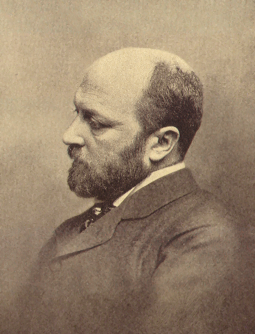

# The Turn of the Screw

#### Henry James {.unlisted}

*Book Club October 13, 2024*

---

"Wasn't it just a storybook over which I had fallen a-doze and a-dream?"

Sigmund Freud presented his first ground-breaking monograph, "The Aetiology of 
Hysteria," in 1896 -- just a year before *The Turn of the Screw* was written. 
In this paper Freud laid out the first of his theories of the connections 
between false narratives, buried memories, sexual trauma and manifestations of 
maladies with no physical cause.

\captionsetup[figure]{labelformat=empty}
{width=20% fig-align="center"}

At the time Freud was virtually unknown outside Vienna. It is unlikely Henry 
James had any knowledge of the man or the work as he wrote his ghost story. 
But Freud was more than just a chronicler of the psychological turmoil of 
*fin-de-siecle* nineteenth-century Europe, he was a product of it as well; as 
was James -- he was enveloped in the same miasma.

Freud asserted that trauma creates chains of memories, many of which are lost 
to the patient's grasp, but can be retrieved link-by-link by psychoanalysis. He 
claimed that when the source memory of the trauma was at last dragged into the 
light, patients had a chance for relief from their mental distress and physical 
symptoms.

*The Turn of the Screw* lays out literary chains of text, testimony, memory, 
truth, falsehood, point of view, climax and resolution; but they do not link 
up. Whether the testimony given is evidence of trauma, mystical visitation, 
madness, lies or other things not dreamt of has been debated since the story’s 
publication. But there are no answers for the reader, no resolution to provide 
relief.

What is unambiguous about the story is that it is structured as a chain, a 
hierarchy, of narratives. The originating voice tells of of a ghost 
story-telling party on Christmas Eve, where a friend named Douglas hints at a 
story to top them all: a supposedly true tale told to him by his sister’s 
governess decades ago. When the guests demand that he tell, Douglas begs for a 
delay and takes the trouble to order up a manuscript stored under lock and key 
at his home. Days later the text is delivered and late that night Douglas reads 
the account of the governess -- her encounters with the ghosts of a man and a 
woman (her predecessor) as she struggled with a new job caring for a young boy 
and his sister in an old and isolated country mansion.

James was not a psychologist, and he didn’t owe anyone any answers about what 
may or may not have been going on at any level. But as the first and final link 
in the chain, he could only take away so much if he was to leave the reader 
with a story. And a hierarchy is a kind of metaphor; "as above so below", or 
"because this is here that is there" -- its existence is a kind of 
illumination. What that light irreducibly reflects is the one binding kink that 
he could not unshackle, that he was a creator and presenter of fictions.

The narrative of the young and inexperienced governess in the manuscript read 
by Douglas has glaring deficiencies, both as a description of events and as a 
depiction of a whole and real person. It is a dance of associations and 
dissociations, rather than a journey of relationships. Her job application 
process with the master of Bly House goes marvelously well, but then he 
abruptly introduces a discontinuity by absenting himself from the remainder of 
the tale. When she arrives at the house she finds the housekeeper Mrs. Grose 
miraculously empathetic and trusting. The children are preternaturally 
good-natured and attractive. When left alone in her luxurious bedroom to unpack 
she catches her reflection in the full-length mirror, and remarks with some 
wonder that it is the first time in her life that she has seen her entire 
reflection. Her identity is an assemblage of fragments rather than something 
that feels whole.

Everything to her is at once so lovely and so strange that she muses openly 
whether she has fallen into some kind of fairy story; then she abruptly 
switches gears:

\medskip
<i>

|    No; it was a big ugly antique but convenient house, embodying a few features of
|    a building still older, half-displaced and half-utilised, in which I had the
|    fancy of our being almost as lost as a handful of passengers in a great
|    drifting ship. Well, I was strangely at the helm!

</i>
\medskip

Three images of her situation in one paragraph, each one suggestive of hidden 
layers, concealed darkness, discontinuity and isolation; and no evident 
awareness of how these musings hint at the fragmentation of self.

It is not surprising that the development of the narrative is consistent with 
its opening. The governess (and only she) sees ghosts, but gets validation from 
her descriptions that they must be those of real people, the former valet and 
governess. The actions of the ghosts hint at a traumatic backstory and a 
nefarious purpose, but nothing of either is revealed; rather, the obsessions 
with the ghosts are abruptly dropped and replaced with another focus -- the 
question of why the boy was expelled from school.

The narrative is one of trails followed into the wilderness and then abandoned, 
unlinked to one another. The climax is not one of revelation, insight or even 
irony, but of, again, dissociation. The governess sends out of the house 
everyone who might have a human influence on her so that she can be isolated 
with the boy, but the result is simply the abrupt stoppage of both a heart and 
the text. 

Frightening? Disturbing? Yes, but for reasons not of the plain types expected 
or related by the mainstream of the work’s readers and critics. The horror is 
rather more in the line of that which would arise from a friend digging up and 
casually reading a draft of a suicide note among company.

Because although the chains of narrative and character within the manuscript do 
not link up, the manuscript itself is a component of the hierarchy of testimony 
that composes the work. And following that hierarchy leads inevitably to 
Douglas himself.

The ways that Douglas debuts and introduces the manuscript of the governess are 
incongruous, in both psychological and practical terms:

Douglas seems strangely invested on an emotional level, in a manuscript he says 
was given to him decades ago, containing a memorialization of events that were 
related to him decades earlier, which took place decades more before that and 
did not involve him. "He had broken a thickness of ice," the originating voice 
says,  "the formation of many a winter; had had his reasons for a long 
silence." He was "really at a loss how to qualify it. He passed his hand over 
his eyes, made a little wincing grimace." More evocations of hidden layers, 
discontinuity and isolation, of unaddressed hysterical complexes and buried 
emotions. 

He makes a flourish of having the manuscript retrieved from his home, that task 
and his buildup to the reading event take the better part of a week.

Practical matters appear in retrospect: Douglas says "She had never told any 
one. It wasn't simply that she said so, but that I knew she hadn't. I was sure; 
I could see." But how could such a story be kept under wraps? How could the 
story of a young boy dying suddenly in the arms of his governess, after she had 
taken pains to be alone with him, be elided from news and rumor, and even her 
personal history? After all, Douglas said that she was governess to his younger 
sister. How could she get another such job with that episode in her background? 
Especially since it was preceded by months of the governess confiding with the 
housekeeper detailed stories of encounters with ghosts. 

Wouldn’t references surely have been checked? In Victorian England evidence of 
madness or mental illness was not a thing to be taken lightly (let alone 
homicide), and hardly something to be invited into a family home. This is 
characteristic of a fabrication. The teller concocts a rationalization for 
evident problems with the story, only to create more implausibilities which are 
never accounted for.

On the most basic level of practicality, Douglas says the manuscript is in his 
possession because "she sent me the pages in question before she died." But 
when these "pages" at last arrive, they are in the form of an "old-fashioned 
gilt-edged album" with a "faded red cover." At the time of the tale’s supposed 
writing, writing paper itself was something of a luxury. But a bound volume of 
gilt-edge blank sheets? That would seem to be well out of the range of a 
governess’s wage. But it is a thing that an older bachelor Cambridge alumnus 
living in London might easily obtain.

The weight of these various considerations suggests that the tale is a 
contrivance and an indulgence authored by Douglas himself, a product of 
psychological stresses within him that he does not understand, in an 
ineffectual attempt to address and treat traumas whose meanings and 
recollections are submerged -- as is consciousness of their impact on him. The 
horror of the story is the evidence of Douglas’s need to unburden himself of 
his traumas in a public and dramatic way once the chance presented itself to 
him, and the induction suggested by the hierarchy of narrative that his acting 
out resolved nothing, leaving him as well as the reader hanging. It is in the 
nature of hysteria that an attempt by the sufferer to self-treat simply buries 
the secrets deeper and makes the suffering worse. It amounts in the end to 
another turn of the screw. 

Freud the scientist witnessed the cycles of suffering, self-delusion and mental 
dissonance of his patients, and claimed a breakthrough in identifying and 
treating their traumas. He explicitly described the complexes of memory and 
association he uncovered as nodes in a hierarchy. Henry James the writer was 
passive by contrast, an oracle offering only a reflection to the supplicant.

Which approach was more effective? Or rather, less a waste of time? The 
millennial anxiety of the era could not be arrested or diverted, and the only 
certainty was that the future would embody a discontinuity. Disaster lay ahead. 
But can the chains of memory and association be broken, or are the 
discontinuities integrated into a structure of higher dimension, a fractal? 
That is to say apropos Freud and James, who was the hack and who the prophet?
